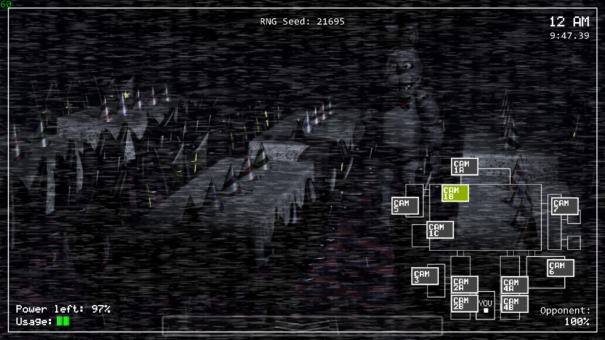

> [!IMPORTANT]
> This project is a Work In Progress, so no stable releases currently exist. All information is subject to change.

# FNaF 1 GML Port w/ 1v1 Matchmaking
Faithful GML (GameMaker Language) recreation of the original **Five Nights at Freddy's 1**, with **1v1 matchmaking**.

## Features
- **FNaF 1 Port:** Recreated mechanics and visuals to be as close to the original game as possible.
- **1v1 Matchmaking:** 1-on-1 matchmaking, with the ability to host/join available rooms.
- **Delta-Time, Optimization, QOL Fixes:** Improved upon many performance & gameplay issues from the original game, along with ensuring both players have a fair advantage, no matter their computer specs. 

## Disclaimer & License
All *Five Nights at Freddy's* rights, assets and sounds are owned by **Scott Cawthon**.
